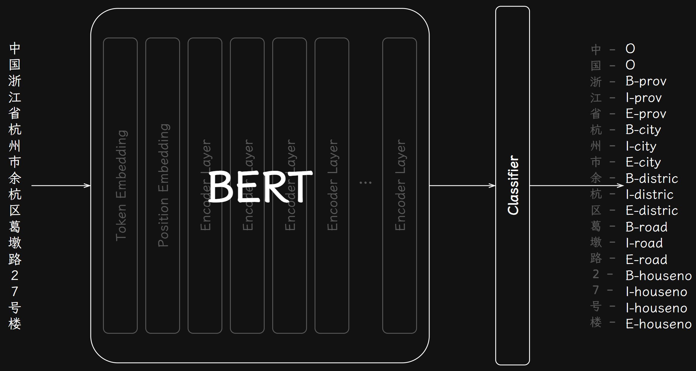
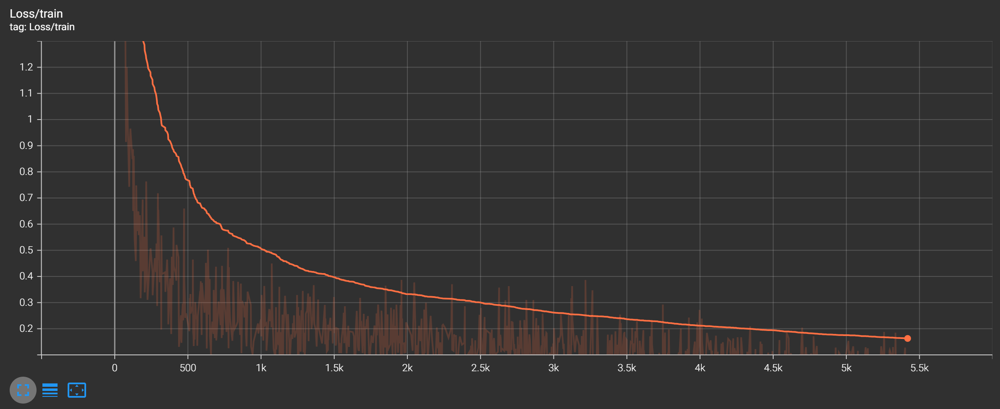
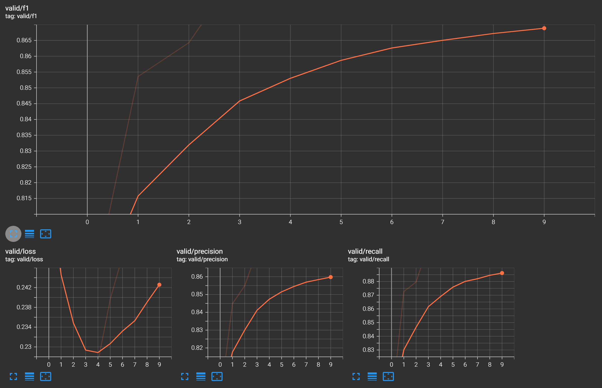
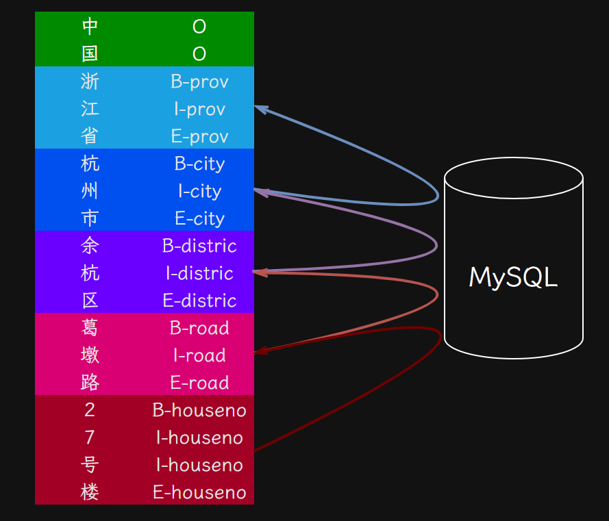

# 1. 序列标注模型

使用模型对给定文本中的每个字进行地址归类标注，将其归类为省、市、区县、街道等。

基于BERT预训练模型，添加一个线性层作为分类头，进行序列标注任务。

# 2. 模型训练过程

在模型训练过程中，监控模型在训练集上的损失，以及模型在验证集上的损失、精确率、召回率和F1分数。保存效果最佳的模型权重参数。

训练集损失：

验证集F1分数、损失、精确率、召回率：

# 3.地址对齐实现

按标签对地址进行分类，获取多个层级的地址信息。

每一级根据数据库校验是否属于上一级地址。并根据校验结果修改或填充这一级或上级地址信息。

